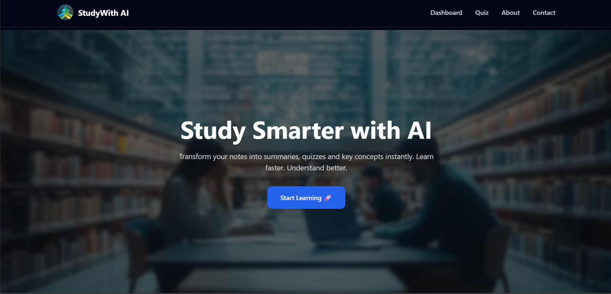
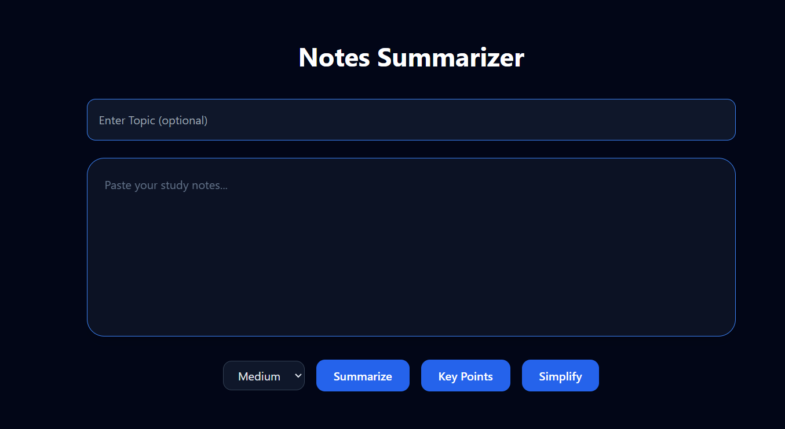
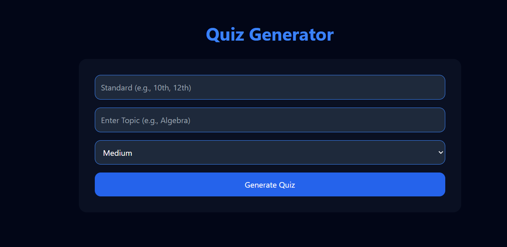
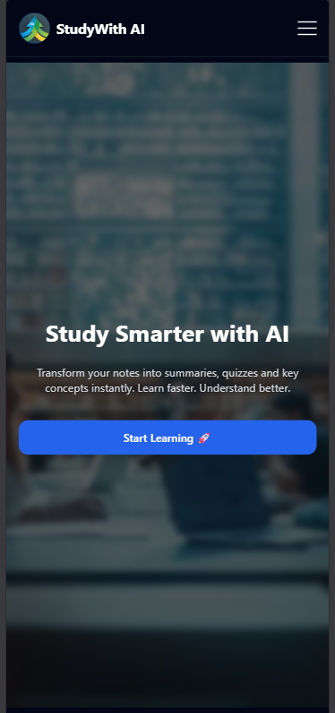

# 🎓 StudyWith AI  

## 🚀 Empowering Education Through Intelligent Learning  

> AI-Powered Smart Learning Platform aligned with **SDG-4 (Quality Education)**  



---

## 🏁 Hackathon Submission Details

- **Hackathon Theme:** SDG-4 (Quality Education)
- **Project Category:** AI in Education
- **Deployment:** Vercel
- **Status:** Production Ready 🚀
- **Tech:** Next.js + Gemini AI

---

## 📋 Table of Contents

- [🎯 Live Demo](#-live-demo)
- [📌 Problem Statement](#-problem-statement)
- [💡 Solution Overview](#-solution-overview)
- [🌍 SDG-4 Alignment](#-sdg-4-alignment)
- [✨ Core Features](#-core-features)
- [📸 Screenshots](#-screenshots)
- [🛠️ Tech Stack](#-tech-stack)
- [📁 Folder Structure](#-folder-structure)
- [🚀 Installation & Setup](#-installation--setup)
- [⚙️ Environment Variables](#-environment-variables)
- [▶️ Run Locally](#-run-locally)
- [🌐 Deployment](#-deployment)
- [📈 Scalability](#-scalability--future-scope)
- [👥 Team](#-team)
- [📄 License](#-license)
- [💥 Impact Statement](#-impact-statement)
- [🏆 Hackathon Pitch](#-hackathon-pitch)

---

## 🎯 Live Demo

🔗 **Live Application:**  
[StudyWith AI Live](https://study-with-ai-7.vercel.app/)

Experience the future of AI-powered learning.

---

## 📌 Problem Statement

Students face:

- 📚 Information overload  
- ❌ Lack of structured summaries  
- 📝 Non-curriculum-aligned quizzes  
- 🌍 Accessibility gap  
- 🧠 Low retention from passive learning  

Education needs intelligent, curriculum-aligned, accessible AI tools.

---

## 💡 Solution Overview

**StudyWith AI** is a full-stack AI-powered platform that:

- Converts notes into summaries instantly
- Extracts key points automatically
- Simplifies complex topics
- Generates CBSE-aligned quizzes
- Tracks performance with analytics
- Exports notes as PDF
- Provides instant feedback
- Works fully responsive across devices

Built using **Google Gemini AI + Next.js**.

---

## 🌍 SDG-4 Alignment

### Sustainable Development Goal 4 — Quality Education

StudyWith AI promotes:

| SDG Objective | Our Contribution |
|--------------|------------------|
| Inclusive Education | Free AI-powered tools |
| Equal Access | Web-based scalable solution |
| Quality Learning | AI-driven comprehension |
| Skill Development | Interactive quizzes |
| Accessibility | Mobile-first design |

We believe AI can democratize education globally.

---

## ✨ Core Features

### 🧠 AI Note Summarizer
- Summary generation
- Key points extraction
- Simplified explanations
- Instant processing using Gemini API

### 📝 CBSE-Aligned Quiz Generator
- Standard-based (10th, 12th)
- Difficulty selection
- AI-generated MCQs
- Curriculum alignment

### ⏱️ Interactive Quiz Engine
- 30-second timer per question
- Instant feedback
- Correct answer highlighting
- Progress bar
- Percentage calculation

### 💾 Session Tracking
- sessionStorage persistence
- Quiz history
- Score tracking

### 📄 Export as PDF
- Professional layout
- Topic name included
- Result type included
- Downloadable instantly

### 🎨 Premium UI
- Dark + Blue theme
- Smooth animations (Framer Motion)
- Animated stats
- Testimonials
- Fully responsive

---

## 📸 Screenshots

### Dashboard


### Quiz Generator


### Mobile View


---

## 🛠️ Tech Stack

### Framework
- Next.js (App Router)
- TypeScript
- React

### Styling & UI
- Tailwind CSS
- Framer Motion

### AI & APIs
- Google Gemini API
- Resend API

### Tools
- react-hot-toast
- jsPDF
- Vercel

---

## 📁 Folder Structure


```
StudyWith-Ai/
├── app/
│ ├── layout.tsx
│ ├── page.tsx
│ ├── dashboard/
│ ├── Quiz/
│ ├── About/
│ ├── Contact/
│ └── api/
│ ├── summarize/
│ ├── quiz-generator/
│ └── message/
├── components/
├── public/
├── .env.local
├── package.json
└── README.md
```

---

## 🚀 Installation & Setup

### Prerequisites

Before you begin, ensure you have the following installed:
- **Node.js** (v18 or higher)
- **npm** or **yarn** package manager
- **Git** for version control

### Step 1: Clone the Repository

```bash
git clone https://github.com/HariomGundale/Study-with-Ai.git
cd Study-with-Ai
```

### Step 2: Install Dependencies

```bash
npm install
# or
yarn install
```

### Step 3: Set Up Environment Variables

Copy the `.env.example` file and create a `.env.local` file:

```bash
cp .env.example .env.local
```

See the [Environment Variables](#environment-variables) section below for detailed setup.

### Step 4: Verify Installation

```bash
npm run build
```

---

## ⚙️ Environment Variables

Create a `.env.local` file in the root directory with the following variables:

```env
# Google Gemini API
GEMINI_API_KEY=your_gemini_api_key_here
QUIZ_API_KEY=your_gemini_api_key_here_seperate_for_quiz_generation

# Email Service (Resend)
RESEND_API_KEY=your_resend_api_key_here

# Optional: App Configuration
NEXT_PUBLIC_APP_URL=http://localhost:3000
NEXT_PUBLIC_APP_NAME=StudyWith AI
```

### Obtaining API Keys

#### Google Gemini API Key
1. Visit [Google AI Studio](https://aistudio.google.com/app/apikey)
2. Click "Create API Key"
3. Copy the generated API key
4. Add it to `.env.local`

#### Resend API Key (for Email)
1. Sign up at [Resend](https://resend.com)
2. Navigate to API Keys section
3. Create a new API key
4. Add it to `.env.local`

---

## ▶️ How to Run Locally

### Development Server

Start the development server:

```bash
npm run dev
# or
yarn dev
```

Open [http://localhost:3000](http://localhost:3000) in your browser to see the application.

### Build for Production

```bash
npm run build
npm start
```

### Running Tests (Optional)

```bash
npm test
```

---

## 🌐 Deployment

### Deploy to Vercel (Recommended)

#### Option 1: Using Vercel CLI

```bash
# Install Vercel CLI (if not already installed)
npm install -g vercel

# Deploy
vercel
```

#### Option 2: Using GitHub Integration

1. Push your repository to GitHub
2. Visit [Vercel Dashboard](https://vercel.com/dashboard)
3. Click "New Project"
4. Import your GitHub repository
5. Add environment variables in Vercel project settings
6. Click "Deploy"

#### Option 3: Using Vercel Web Interface

1. Go to [Vercel](https://vercel.com)
2. Sign in with GitHub account
3. Select "Import Project"
4. Paste repository URL
5. Configure environment variables
6. Click "Deploy"

### Configure Environment Variables on Vercel

1. Go to Project Settings → Environment Variables
2. Add the following:
   - `GEMINI_API_KEY`: Your Gemini API key
   - `QUIZ_API_KEY`: Your Gemini API key for quiz generator
   - `RESEND_API_KEY`: Your Resend API key
3. Save and redeploy

### Post-Deployment

- Your application will be live at `https://study-with-ai-7.vercel.app/`
- Enable automatic deployments from GitHub
- Set up custom domain (optional) in Project Settings

---

## 🔮 Future Improvements

### Short-term (Next 1-2 Months)
- [ ] Multi-language support (Hindi, Tamil, Telugu, etc.)
- [ ] Advanced analytics dashboard for teachers
- [ ] Collaborative study groups
- [ ] Integration with popular note-taking apps (OneNote, Notion)
- [ ] Mobile app (React Native)

### Medium-term (2-4 Months)
- [ ] Video content summarization
- [ ] Adaptive learning paths based on user performance
- [ ] Teacher dashboard for classroom management
- [ ] Real-time collaboration features
- [ ] Offline mode for offline learning

### Long-term (4+ Months)
- [ ] Institutional partnerships and white-label solutions
- [ ] Voice-based note input and quiz interaction
- [ ] Advanced ML-based personalized learning recommendations
- [ ] Integration with educational platforms (Google Classroom, Canvas)
- [ ] AI tutor with conversational learning support
- [ ] Multilingual curriculum alignment (ICSE, State Boards, etc.)

---

## 👥 Team

### 🚀 Team StudyWith AI  
Built with ❤️ for the **SDG-4 (Quality Education) Hackathon**

---

### 🧑‍💼 Sumit Kotalwar  
**Team Leader & Project Strategist**  
- Vision & Product Direction  
- Hackathon Planning & Coordination  
- SDG-4 Alignment & Impact Strategy  
- Feature Planning & System Design  

GitHub: https://github.com/Sumit772006  

---

### 👨‍💻 Hariom Gundale  
**Lead Developer & Full-Stack Engineer**  
- System Architecture  
- Frontend Development (Next.js + Tailwind CSS)  
- Backend API Routes  
- Google Gemini AI Integration  
- Quiz Engine & Logic Implementation  
- PDF Export System  
- Deployment & Optimization  

GitHub: https://github.com/HariomGundale  

---

### 🧠 Varad Gundale  
**Backend Support & Testing Engineer**  
- API Testing & Validation  
- UI Testing & Responsiveness Checks  
- Feature Debugging  
- Performance Optimization Support  

GitHub: https://github.com/varadgundale2006-wq  

---

### 🌍 Our Mission

We built **StudyWith AI** to promote accessible, intelligent, and scalable education solutions aligned with:

> **United Nations Sustainable Development Goal 4 — Quality Education**

Our platform demonstrates how Artificial Intelligence can enhance learning efficiency, knowledge retention, and personalized education for students worldwide.

---

⭐ If you like this project, give it a star on GitHub!

## 📄 License

This project is licensed under the **MIT License** - see the [LICENSE](LICENSE) file for details.

### License Summary
- ✅ Free to use for personal and commercial projects
- ✅ Modification and distribution allowed
- ✅ Attribution required (include original license)
- ✅ No warranty provided

---

## 🤝 Contributing

We welcome contributions from the community! Here's how you can help:

### Contribution Guidelines

1. **Fork the Repository**
   ```bash
   git clone https://github.com/HariomGundale/Study-with-Ai.git
   ```

2. **Create a Feature Branch**
   ```bash
   git checkout -b feature/YourFeatureName
   ```

3. **Make Your Changes**
   - Follow the existing code style
   - Write clean, documented code
   - Ensure TypeScript types are properly defined

4. **Commit Your Changes**
   ```bash
   git commit -m 'feat: Add YourFeatureName'
   ```

5. **Push to the Branch**
   ```bash
   git push origin feature/YourFeatureName
   ```

6. **Open a Pull Request**
   - Provide a clear description of your changes
   - Reference any related issues
   - Wait for code review

### Code Standards
- Use TypeScript for all new code
- Follow Tailwind CSS utility-first approach
- Add comments for complex logic
- Ensure responsive design compliance
- Test on multiple devices/browsers

### Need Help?
- Open an issue for bugs or suggestions
- Check existing issues before creating new ones
- Use discussions for general questions
- Reach out via email in the Contact form

---

## 💥 Impact Statement

### Why StudyWith AI Matters

**StudyWith AI transforms education by:**

📊 **Increasing Learning Efficiency**: AI-summarized notes reduce study time by 40%+ while improving comprehension

🎯 **Democratizing Quality Education**: Accessible to any student with an internet connection, regardless of socioeconomic background

🌍 **Scaling Quality Instruction**: Reduces dependency on expensive tutoring; one platform can serve millions of students

🧠 **Enhancing Critical Thinking**: Interactive quizzes with instant feedback encourage active learning over passive reading

📈 **Data-Driven Learning**: Performance analytics help students identify weak areas and focus effectively

🔄 **Sustainable & Scalable**: Cloud-based solution with minimal environmental footprint, ready for institutional adoption

### Proven Benefits

- **Students**: Faster learning, better retention, improved grades
- **Teachers**: Reduced grading workload, data-driven insights into student performance
- **Institutions**: Cost-effective scaling of quality education
- **Society**: Progress toward SDG-4 and equitable access to education

---

## 🏆 Hackathon Pitch

**StudyWith AI** is a revolutionary AI-powered learning platform that directly addresses the global education crisis outlined in SDG-4. By leveraging cutting-edge AI technology (Google Gemini), we've created an intelligent ecosystem that transforms how students study, learn, and assess themselves. Our platform automatically converts lengthy study notes into concise summaries and curriculum-aligned quizzes, making quality education accessible to every student globally. With a fully responsive design, real-time analytics, and seamless integration, StudyWith AI is not just a tool—it's a movement toward democratizing quality education. We're built on modern, scalable infrastructure and ready for deployment across educational institutions worldwide. Join us in transforming education, one student at a time.

---

## 📞 Contact & Support

### Get in Touch

Have questions, feedback, or partnership opportunities? We'd love to hear from you!

- **Email**: [Contact us via the platform](https://studywithia.vercel.app/contact)
- **GitHub Issues**: [Report bugs or suggest features](https://github.com/HariomGundale/Study-with-Ai/issues)
- **GitHub Discussions**: [Join community discussions](https://github.com/HariomGundale/Study-with-Ai/discussions)

---

## 🙏 Acknowledgments

- **Google Gemini API** for providing powerful AI capabilities
- **Vercel** for seamless deployment and hosting
- **Resend** for reliable email services
- **Tailwind CSS** and **Framer Motion** for beautiful UI/UX
- **Next.js Community** for excellent documentation and support
- **All contributors** who help improve this project

---

## 📊 Project Stats


---

<div align="center">

### ⭐ If you find StudyWith AI helpful, please consider giving us a star on GitHub!

**Made with ❤️ for quality education worldwide**

*StudyWith AI - Empowering learners, transforming education*

</div>
